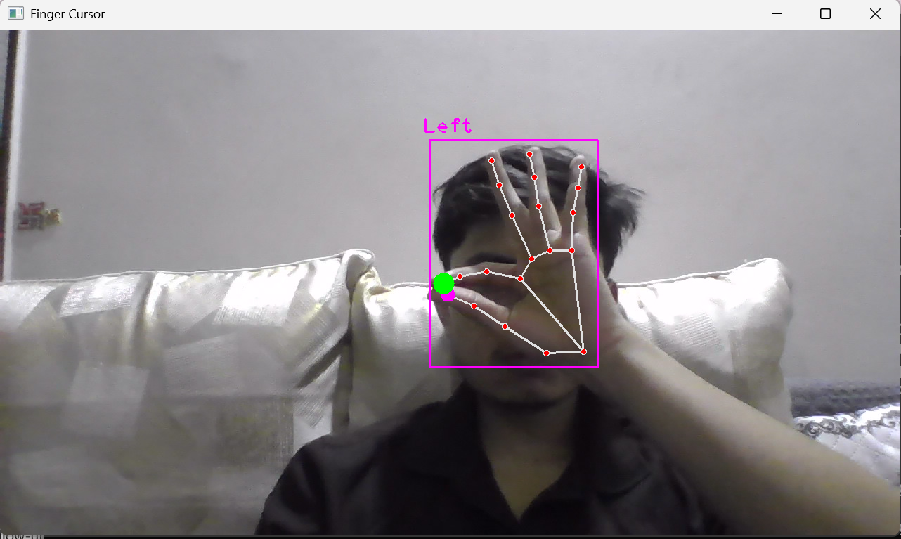
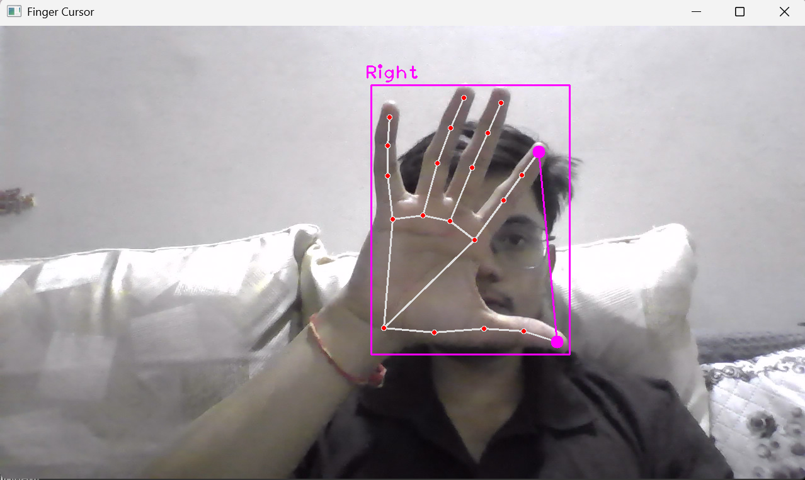

# 🖐️ Hand-Gesture-Based-Cursor-Control

Control your computer cursor using **hand gestures**!  
This project leverages **OpenCV**, **CVZone**, and **MediaPipe** for real-time hand tracking.

---

## **Demo**

  

*Example of moving the cursor using hand gestures.*

---

## **Setup Instructions**

### 1. Open Anaconda Prompt
Install or Search for **Anaconda Prompt** in the Start Menu and open it.

---

### 2. Create a new Conda environment
```bash
conda create -n finger python=3.10 -y
```

### 3. Activate the environment
```bash
conda activate finger
```

### 4. Install dependencies
```bash
pip install opencv-python cvzone pyautogui numpy mediapipe
```

✅ Note: Mediapipe installs correctly with Python 3.10.

### 5. Navigate to your project folder
```bash
cd "C:\Users\<YourUsername>\OneDrive\Desktop\finger-cursor"
```

### 6. Run the project
```bash
python finger_cursor.py
```

### Dependencies
| Library   | Purpose                      | Link                                                     |
| --------- | ---------------------------- | -------------------------------------------------------- |
| OpenCV    | Computer vision library      | [opencv-python](https://pypi.org/project/opencv-python/) |
| CVZone    | Hand tracking & CV utilities | [cvzone](https://pypi.org/project/cvzone/)               |
| PyAutoGUI | Control mouse & keyboard     | [PyAutoGUI](https://pypi.org/project/PyAutoGUI/)         |
| NumPy     | Numerical computing          | [NumPy](https://pypi.org/project/numpy/)                 |
| MediaPipe | Hand tracking & ML solutions | [MediaPipe](https://pypi.org/project/mediapipe/)         |


